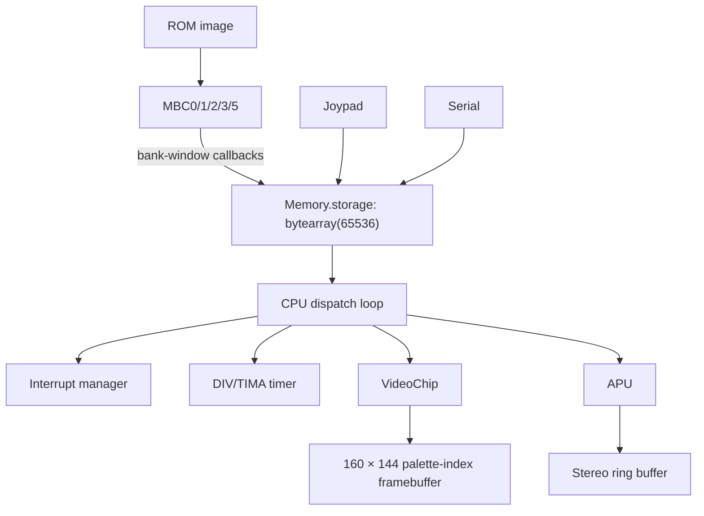

# PyGameBoy architecture

PyGameBoy is a DMG emulator optimized for CPython without moving the CPU core
into a native extension. This document describes the current implementation,
including the boundaries where speed is deliberately traded for accuracy or
debuggability.

## System map



## 1. Flat memory with routed writes

Most CPU reads use a single 64 KiB `bytearray`. A read such as instruction fetch
is therefore a direct index operation:

```python
opcode = memory[registers.PC]
cycles = dispatch[opcode]()
```

Writes cannot all be direct because cartridge control ranges, mirrored WRAM,
I/O registers, DMA, and audio registers have side effects. `Memory.write_byte`
routes them through a 256-entry table indexed by the high address byte:

```python
write_pages[address >> 8](address, value)
```

### Cartridge-window invariant

`Memory.storage[0x0000:0x8000]` and `Memory.storage[0xA000:0xC000]` must always
represent what the CPU can currently observe. MBC bank-change callbacks replace
whole visible windows. Incremental RAM-write callbacks preserve
controller-specific behavior without copying 8 KiB on every save-RAM write:

- MBC2 stores four-bit values, exposes the upper nibble as ones, and mirrors
  each 512-byte location throughout the 8 KiB external-RAM window.
- MBC3 RTC registers, when selected, appear across the external-RAM window.
- Banked RAM writes update the active flat address while retaining data in the
  selected physical bank.

Integration tests exercise these rules through `Memory`, because testing an MBC
object alone cannot detect a stale flat mirror.

## 2. CPU dispatch and instrumentation

The CPU builds a 256-entry list of bound opcode methods during initialization.
Normal execution caches frequently used objects and callables as local
variables, then dispatches directly from the flat memory buffer.

`CPU.run(fast=False)` intentionally uses the public `step()` path. It is slower,
but provides a stable place for debuggers and future tracing. Opcode profiling
is opt-in and accumulates counts in a fixed 256-entry list; the fast path pays
no counting cost when profiling is disabled.

Opcode bodies are explicit Python methods. Some hot register operations are
inlined, which improves throughput at the cost of repetition. `refactor.py` is
a guarded, dry-run-by-default historical rewrite tool; importing it never
changes source code.

Instructions with externally observable multi-cycle bus activity advance the
timer at their actual read and write phases. This covers immediate-address,
CB-prefixed, and read-modify-write timing without turning every opcode into a
micro-op interpreter. Blargg's `mem_timing` and `mem_timing-2` suites lock those
phases at the system level.

## 3. PPU rendering

The PPU advances through OAM search, pixel transfer, HBlank, and VBlank using
cycle counts. Background and window scanlines use preallocated NumPy vectors for
tile-map selection, tile addressing, bit extraction, and palette lookup.

Sprite selection uses NumPy for scanline filtering and priority sorting. The
final overlay currently uses short Python loops over at most ten sprites and
their visible pixels. Describing the entire sprite path as vectorized would be
inaccurate; this hybrid keeps priority behavior straightforward while bounding
Python work.

The renderer produces palette indices rather than RGB pixels. The display loop
maps the complete frame through a four-color NumPy palette and transfers it to
Pygame.

Current limitation: timing is scanline based rather than a dot-accurate pixel
FIFO. Mid-scanline register effects and some access restrictions are therefore
not yet modeled.

## 4. APU and pacing

The APU advances oscillator state in CPU-cycle units and emits 44.1 kHz stereo
samples into a fixed-size NumPy ring buffer. A lock protects read/write
positions shared with the `sounddevice` callback.

Pan Docs documents the DMG DAC, mixer, and analog high-pass capacitor in the
hardware references below. Those sources are retained for future sound-fidelity
work; the current real-time path intentionally keeps host processing minimal
while APU timing and channel behavior are still being completed.

With audio enabled, buffer depth acts as the pacing signal:

- A deep buffer pauses CPU production while the audio device drains it.
- A shallow buffer can skip host rendering while emulation and audio continue.
- If audio is disabled or unavailable, Pygame's clock supplies frame pacing.

This design reduces long-term clock drift, but it is not claimed to provide
perfect host-independent synchronization. Device latency, callback scheduling,
and incomplete APU hardware behavior remain measurable sources of variation.

## 5. Serial clock

The DMG serial link shifts one bit every 512 CPU cycles when SC selects the
internal clock. Transfers retain a divider phase aligned to hardware reset,
complete after eight edges, clear SC's start bit, place `0xFF` on SB when no
peer is connected, and request the serial interrupt.

The CPU advances this clock after every dispatched instruction. Because
PyGameBoy skips Nintendo firmware by default, the post-boot initializer seeds
the divider phase observed after a DMG ABC boot. This behavior is locked by
Mooneye's `boot_sclk_align-dmgABCmgb` acceptance ROM as well as focused unit
tests.

External-clock transfers remain pending because link-cable peer emulation is
not implemented yet.

## 6. Benchmark methodology

`benchmark_cpu.py` measures one real configuration: the bytearray-backed direct
dispatch path used by the emulator. Each case receives one warm-up, followed by
multiple measured runs summarized by the median. Reports include minimum and
maximum cycle rates in JSON, along with Python and platform metadata.

The benchmark does not claim full-emulator performance. PPU, APU, display,
input, and host scheduling costs are intentionally excluded. A benchmark change
should be accompanied by:

1. A correctness test for the optimized behavior.
2. Before/after JSON generated on the same host and interpreter.
3. Median results from multiple runs.
4. An explanation of any readability or accuracy tradeoff.

## 7. Accuracy roadmap

The highest-value remaining hardware work is:

1. Dot-accurate PPU/FIFO timing and memory-access restrictions.
2. MBC1 multicart variants and a running MBC3 RTC.
3. Channel-1 frequency sweep and register read masks.
4. OAM corruption behavior and remaining timer/interrupt edge cases.
5. Save states with a versioned serialization format.

## 8. Hardware and test references

These references are retained alongside the implementation so timing,
electrical-model, and conformance decisions remain auditable:

- [Pan Docs: Audio overview](https://gbdev.io/pandocs/Audio.html)
- [Pan Docs: Audio details, DACs, mixing, and DMG high-pass filter](https://gbdev.io/pandocs/Audio_details.html)
- [Pan Docs: Audio registers](https://gbdev.io/pandocs/Audio_Registers.html)
- [Mooneye Test Suite](https://github.com/Gekkio/mooneye-test-suite), with
  the exact vendored commit and fixture checksums recorded in
  [`tests/roms/mooneye/README.md`](tests/roms/mooneye/README.md)
- [Blargg Game Boy test ROM collection](https://github.com/retrio/gb-test-roms/tree/c240dd7d700e5c0b00a7bbba52b53e4ee67b5f15),
  pinned to the same commit used by the conformance workflow
- [PyGameBoy test-ROM conformance and deployment policy](docs/conformance.md)
