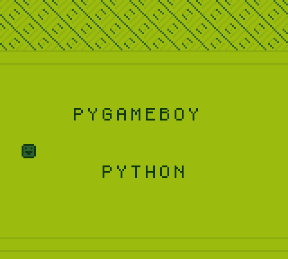
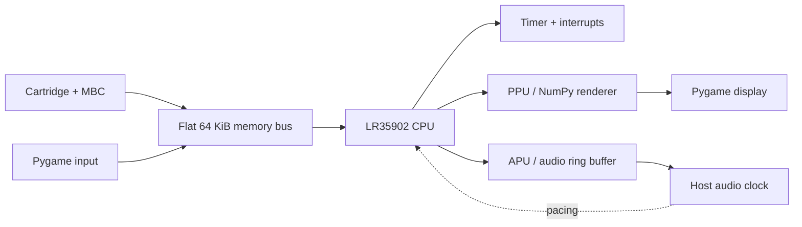

# PyGameBoy

[](https://github.com/Obscuretone/pygameboy/actions/workflows/ci.yml)
[](pyproject.toml)
[](https://obscuretone.com/pygameboy/)
[](https://www.python.org/)
[](LICENSE)

A performance-focused Nintendo Game Boy (DMG) emulator written in Python,
Pygame, and NumPy.



PyGameBoy explores a specific engineering question: how far can a readable,
tested CPython emulator go when its hottest paths are designed around Python's
cost model? The result combines a flat 64 KiB memory bus, pre-bound opcode
dispatch, vectorized scanline rendering, and audio-clock pacing.

## Highlights

- Complete legal LR35902 base-opcode dispatch with interrupt and timer support.
- MBC0, MBC1, MBC2, MBC3, and MBC5 cartridge banking.
- Background, window, and DMG sprite rendering.
- Four-channel APU with bipolar DMG DAC mixing, AC coupling, stereo routing,
  and a lock-protected audio ring buffer.
- Battery-backed cartridge saves written with atomic file replacement.
- Fast frame execution plus an instrumentable single-step/profile path.
- Toggleable live register, PPU, audio-buffer, and timing overlay with separate
  emulated-frame, presented-frame, skipped-frame, and clock-speed telemetry.
- Bundled Obscuretone Test ROM checks with live display/serial progress, every
  legal CPU opcode, every CB opcode, hardware subsystems, and MBC variants.
- Unit, integration, headless CLI, and external test-ROM checks on Python
  3.10–3.13.

The emulator is intentionally DMG-focused. Pixel-FIFO timing, a running MBC3
real-time clock, channel-1 frequency sweep, save states, and Game Boy Color
features remain future work.

## Quick start

```bash
git clone https://github.com/Obscuretone/pygameboy.git
cd pygameboy
python -m venv .venv
source .venv/bin/activate
python -m pip install -e ".[audio]"
pygameboy path/to/game.gb
```

Audio is optional. Install without the `audio` extra and pass `--no-audio` if
PortAudio or an output device is unavailable.

PyGameBoy does not include commercial game ROMs or Nintendo firmware. Supply
ROMs that you are legally entitled to use. The original boot animation is
optional and requires a user-supplied 256-byte image:

```bash
pygameboy --boot-rom /path/to/DMG_ROM.bin path/to/game.gb
```

Without a boot ROM, PyGameBoy starts from the documented post-boot DMG register
state. Maintainers should also follow the
[firmware/history policy](docs/firmware.md) before publishing a repository that
previously contained firmware.

## Controls

| Game Boy | Keyboard |
|---|---|
| D-pad | Arrow keys |
| A | Z |
| B | X |
| Start | Enter |
| Select | Space or Right Shift |
| Debug overlay | F1 |

Useful runtime options:

```text
--scale N              Integer display scale
--no-audio             Disable audio output
--no-realtime          Run without host-clock throttling
--profile              Print the hottest executed opcodes on exit
--slow-step            Use the instrumentable dispatch path
--max-frames N         Stop after N host frames
--max-instructions N   Stop after N CPU dispatches
--max-cycles N         Stop after N emulated cycles
```

Run `pygameboy --help` for the complete command reference.

## Architecture



The performance model and its correctness invariants are documented in
[ARCHITECTURE.md](ARCHITECTURE.md). The important design choice is that reads
stay flat while side-effecting writes are routed through a 256-entry page table.
MBC callbacks keep the visible ROM and cartridge-RAM windows synchronized after
bank changes and controller-specific writes.

## Quality and benchmarks

Install the development tools and run the same checks used in CI:

```bash
python -m pip install "uv==0.12.0"
uv sync --frozen --extra dev
uv run --frozen ruff check .
uv run --frozen pytest --cov=. --cov-report=term-missing
uv run --frozen python audit_cpu.py
uv run --frozen pygameboy-conformance tests/roms/mooneye
```

CI enforces 100% statement and branch coverage across every production module.
The suite combines the reproducible
[Obscuretone Test ROM](https://github.com/Obscuretone/obscuretone-test-rom),
exhaustive opcode matrices,
synthetic-ROM system tests, hardware state-machine tests, renderer checks, host
failure-path coverage, and pinned Mooneye acceptance ROMs.

CPU microbenchmarks exercise the same production max-cycle dispatch loop used
for normal frames. They use one warm-up followed by median measured runs.
Results include interpreter, platform, clock target, execution path, and raw
JSON so comparisons remain auditable:

```bash
uv run python benchmark_cpu.py \
  --repeats 5 \
  --json benchmarks/latest.json \
  --markdown BENCHMARKS.md
```

See the checked-in [benchmark report](BENCHMARKS.md). It measures isolated CPU
dispatch throughput, not whole-emulator compatibility or frame rate.

## Compatibility philosophy

Passing project tests is necessary but not sufficient for emulator accuracy.
New hardware behavior should be tested through the integrated `Memory`/`CPU`
path, not only through a component in isolation. The headless conformance
runner understands OTR's `OTR/1` events and mailbox, Mooneye register
signatures, and Blargg serial/memory reports. The published floor covers CPU
instructions, instruction timing, memory-access timing, DMA, timer,
serial-clock, and register behavior.

See [test-ROM conformance](docs/conformance.md) for the pinned provenance,
current scope, external-suite commands, result semantics, and the GitHub Pages
compatibility-dashboard deployment.

## Contributing

See [CONTRIBUTING.md](CONTRIBUTING.md) for the development workflow and the
performance-change checklist.

## License

PyGameBoy source code is available under the [MIT License](LICENSE). Nintendo,
Game Boy, and related marks belong to their respective owners.
